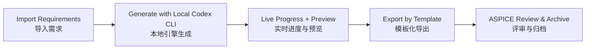

<div align="center">

# DMS Test Studio

### ASPICE-First DMS Test Engineering Platform
### 把需求文档直接变成可交付的 ASPICE 测试规范

<p>
  
  
  
  
  
</p>

<p>
  <a href="#quick-start--30-seconds">Quick Start</a> •
  <a href="#why-star-this-project">Why Star</a> •
  <a href="#paid-customization">Paid Customization</a>
</p>

</div>

---

## One-Line Value

**EN**: Not a generic text generator. This is an **ASPICE delivery tool** for DMS test teams.  
**中文**：不是泛生成器，而是面向 DMS 团队的 **ASPICE 交付工具**。

---

## Why Teams Adopt It

| Your Pain | DMS Test Studio Solves | Delivery Result |
|---|---|---|
| 需求到用例靠手工整理 | 自动构建 Requirement ID ↔ Test Case 追踪关系 | 追踪链路完整、可审计 |
| 输出格式不统一、反复返工 | 严格按 `模板.xlsx` 结构化导出 | 直接进入评审与交付 |
| 覆盖率要人工统计 | 自动覆盖率摘要 + 未覆盖需求提示 | 快速定位缺口 |
| 用例看起来像“文字游戏” | 强化实车可执行步骤与判定点 | 测试员可落地执行 |

---

## ASPICE Is the Core, Not a Side Feature



**Output you can submit / 可提交交付物**

- `ASPICE_Test_Specification_*.xlsx`
- Requirement traceability links / 需求追踪关系
- Coverage summary / 覆盖率摘要
- Document metadata / 文档控制信息

---

## Quick Start ( 30 Seconds )

1. Download release package and unzip.
2. Run `DMS Test Studio.exe`.
3. Import requirement file.
4. Configure cases per requirement.
5. Generate and export ASPICE specification.

Runtime requirements:

- Windows 10/11 x64
- Local Codex CLI installed and logged in
- `codex` command available in terminal

---

## Download Compiled Package

Important: **Do not run a standalone exe without `_internal`**.  
The app requires the full portable directory (`DMS Test Studio` + `_internal`) to run.

Primary download (recommended):

- https://github.com/zgc37359-lang/dms-test-studio/releases/download/v1.0.0/DMS_Test_Studio_Windows_1.0.0.zip

Release page:

- https://github.com/zgc37359-lang/dms-test-studio/releases/tag/v1.0.0

Backup method (split parts under `release_parts/`):

Windows merge command:

```bat
copy /b DMS_Test_Studio_Windows_1.0.0.zip.part01+DMS_Test_Studio_Windows_1.0.0.zip.part02+DMS_Test_Studio_Windows_1.0.0.zip.part03+DMS_Test_Studio_Windows_1.0.0.zip.part04 DMS_Test_Studio_Windows_1.0.0.zip
```

After merge, unzip `DMS_Test_Studio_Windows_1.0.0.zip` and run `DMS Test Studio.exe`.

One-click option:

- Run `release_parts/restore_and_run.bat`

---

## Free Edition

Included in current release:

- Requirement import
- Test case generation
- ASPICE template export
- Coverage summary

---

## Paid Customization

Enterprise-grade options:

- Custom ASPICE templates and field schema
- Domain glossary and project-specific style tuning
- Private deployment and toolchain integration
- Review/sign-off workflow extension
- Commercial UI branding package

Contact: `1797779200@qq.com`

---

## Why Star This Project

- You need an **ASPICE-first** desktop workflow, not a generic AI demo.
- You want a **local CLI-based** generation path for practical enterprise usage.
- You care about **traceability + coverage + delivery format** in one place.

If this matches your workflow, give it a Star.

---

## FAQ

### Is this source-collaboration ready?

No. This repository is currently for binary distribution only.

### Is this free to use?

Yes. Current version is Free Edition.

### Is paid enterprise support available?

Yes. Paid customization is available.

### Can outputs be used in ASPICE review directly?

Yes, the product is designed around template-based ASPICE delivery.

---

## Security & Data

- No built-in private project assets
- Content generated from your local input and local CLI session
- Release package excludes training/model cache directories

---

## Version

- Current: `1.0.0`

## License

See `LICENSE`.
